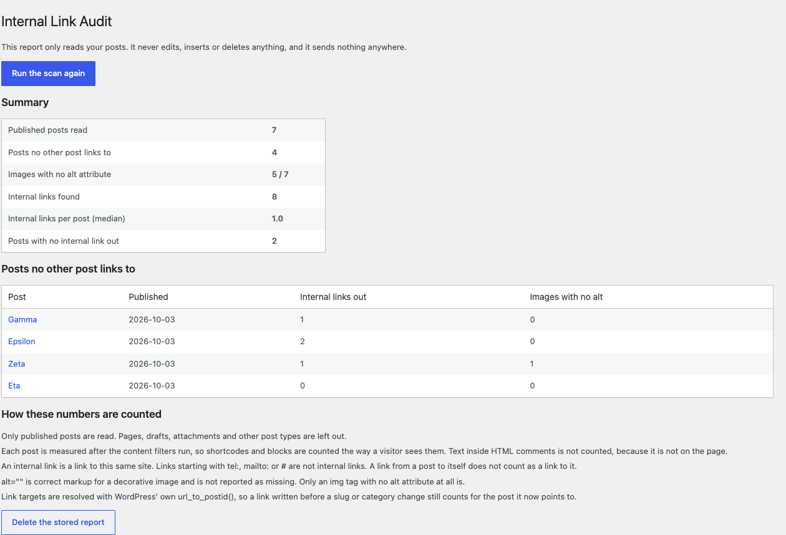

# Internal Link Audit

A WordPress plugin that reports three things about a blog that are invisible while you
work on one post at a time:

1. **Published posts that no other post links to.** A post can be live, indexed and
   perfectly good and still have nothing inside your own site pointing at it.
2. **Images with no `alt` attribute.** Not `alt=""`, which is the correct markup for a
   decorative image, but images with no attribute at all.
3. **How many internal links each post has**, and which posts have none going out.

It is **read only**. It never edits a post, never writes to the front end, and makes no
HTTP request of any kind.

Admin screen: **Tools → Internal Link Audit**. Requires the `manage_options` capability.



## Install

Download the zip from the [v1.0.1 release](https://github.com/honokasoftware-ai/internal-link-audit/releases/tag/v1.0.1)
and upload it under *Plugins → Add New → Upload Plugin*, or copy `plugin/` into
`wp-content/plugins/internal-link-audit/`.

```
sha256  919fc533e76ac036c73c5c4336d2116f2cf2d928cf074c8e927652b459f3c779
```

The same file is in `dist/` here. `tools/check_release_asset.py` downloads the published
one without a token and fails if its hash is not the one above, so the install
instruction cannot go stale without a check noticing.

Requires WordPress 6.0 or newer and PHP 7.4 or newer. Both ends of that range were run,
not guessed: see the table below.

## How this plugin is checked

Every number in `plugin/readme.txt` is produced by a test, and the tests run against a
real WordPress in Docker rather than against mocks.

| | Result |
|---|---|
| Environments | WordPress **7.1.2** / PHP **8.3.35**; WordPress **6.0.3** / PHP **7.4.32** on 1.0.0 |
| Behaviour | **26 / 26** (`tools/harness.py`) |
| The Plugin Review Team's own checker | **0 findings** (`tools/plugin_check.py`, plugin-check 2.1.0) |
| The readme's own claims | **29 / 29** (`tools/readme_test.py`) |
| Sabotage caught | **12 / 12** against the running plugin, **19 / 19** against the readme, **2 / 2** against the checker |
| Raw records | `evidence/` |

The 6.0.3 figure in that first row is from version 1.0.0 and has not been taken again
since; `evidence/verify-6.0.3.json` says which version produced it. 1.0.1 has only been
run on 7.1.2.

Two rules keep the checks honest:

- **Expected values are hand computed.** `tools/harness.py` holds a seven post fixture
  site with the answer for every post written out in a table above the code. Using the
  plugin's own output as the expected value would pass no matter what the plugin did.
- **The tests press the plugin's buttons over HTTP**, after logging in at
  `wp-login.php`. They do not call PHP functions directly, so what is measured is the
  screen an administrator actually sees.

### What you can re-run from this repository

`python3 tools/readme_test.py` (29 checks) and `python3 tools/readme_test.py --sabotage`
(19 deliberate breakages, all of which must be caught) run on a clone with nothing but
Python 3. So does `python3 tools/check_plugin_uri.py`, which fetches the `Plugin URI` in
the header and records the status code, because a URL in a header is a claim about
somewhere else and on 2026-10-03 ours pointed at a repository that returned 404.

`python3 tools/check_release_asset.py` is the same idea one step further out: it asks
GitHub for the release anonymously, downloads the attached zip, and then fetches each of
the four shipped files from the `v1.0.1` tag and hashes them against the zip. A release
left as a draft, a zip rebuilt here after the upload, and a tag serving code the download
does not contain are all invisible from inside the repository, and a stranger meets each
of them as a broken promise on this page.

`tools/harness.py` is the one that needs more than a clone: it drives a WordPress and
MySQL pair in Docker that is **not included here**. What is included is every record it
produced, in `evidence/verify-7.1.2.json` and `evidence/verify-6.0.3.json`, check by
check with the expected and the observed value for each.

`tools/teeth_test.py` then breaks the plugin on purpose, twelve different ways, and
requires each break to be caught, including: a self link rescuing an orphan, counting
inside HTML comments, reading stored content without expanding shortcodes, reporting
`alt=""` as missing, counting `tel:` and `mailto:` as internal links, counting pages as
posts, and returning a mean where a median was promised.

`tools/plugin_check.py` runs the Plugin Review Team's own published checker
(`plugin-check`) against the plugin in that same sandbox, which is a different
measurement from reading their guidelines and grading ourselves. On 2026-10-04 it
reported two things on version 1.0.0 (`evidence/plugin_check-before.json`), and one of
them was not a style note:

> A plugin should not invoke the core hook `the_content`.

We were running the whole `the_content` filter chain to expand shortcodes, which means
**any other plugin hooked there wrote part of our report**. With one related posts
plugin active on the seven post fixture, 8 internal links became 15, 7 images became 14,
and an orphaned post stopped looking orphaned, which is this plugin's headline number.
1.0.1 expands blocks and shortcodes directly instead, and the fixture now ships with
such a plugin permanently active so that every figure above is also a check that
injected markup is ignored (V25 and V26). `tools/plugin_check.py --prove` puts both
defects back and requires the checker to report them again.

### Who can open the report

Two gates sit in front of the screen and only the outer one is visible over HTTP, so the
inner one has to be measured separately. Logged in `editor` and `subscriber` accounts
both get **HTTP 403** on the screen and on the scan, **replaying an administrator's
nonce does not run the scan** (the stored option is byte identical afterwards), and the
plugin's own `current_user_can()` is exercised directly because WordPress stops the
request before the plugin would otherwise be reached.

## WordPress.org plugin guidelines

Written after reading the Detailed Plugin Guidelines, and each point is asserted by a test:

- **5, no trial periods.** Nothing is withheld, expires, or unlocks for money. *(V19)*
- **7, no tracking without consent.** The source contains no `wp_remote_*`, `curl_init`
  or `fsockopen`, so there is no mechanism to call out at all. *(V16)*
- **10, no links or credits on the public site.** The only hook is `admin_menu`. The
  tests fetch the site's front page and check it is unchanged. *(V15, V17)*
- **11, no hijacking the admin.** No `admin_notices`. Output appears only on the
  plugin's own screen. *(V18)*

## Known limits

- The report covers published posts, not pages or custom post types, and stops at 5,000
  posts.
- The permission measurement covered `editor` and `subscriber`. Other roles, custom
  roles and multisite (where `manage_options` means something different) are untested.
- It has not been run on a production site yet, and it is not on WordPress.org yet.
  The release here is the only way to install it today.
- Content a theme or another plugin appends at display time is not counted. On a site
  built with a page builder that stores its content outside `post_content` and renders
  it through `the_content`, this plugin will therefore report few links or none. That is
  not measured on such a site yet.

## Licence

GPL-2.0-or-later. See `LICENSE`.

Built by [Honoka Software](https://github.com/honokasoftware-ai).
